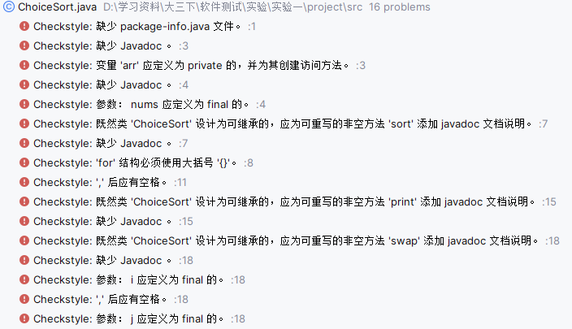
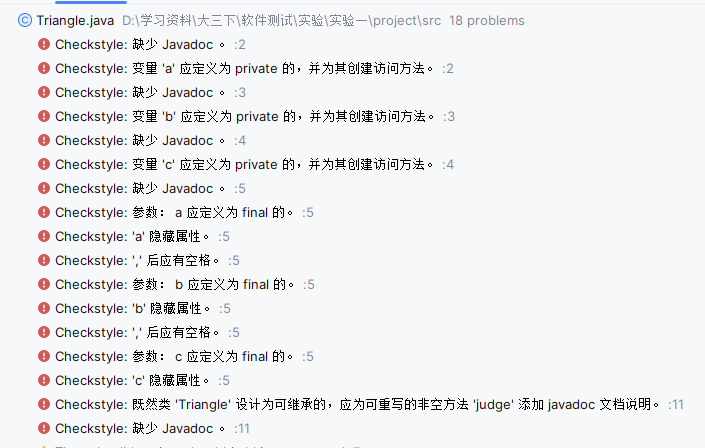
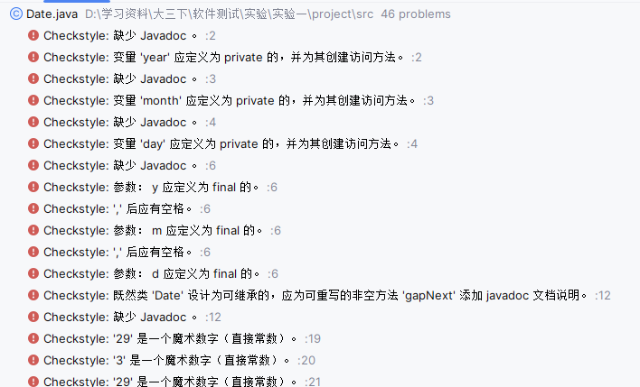
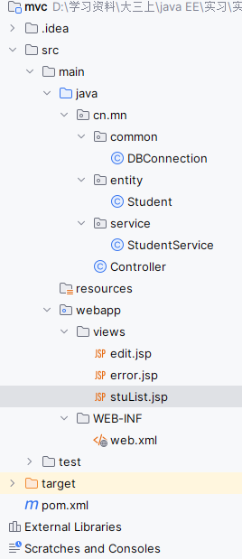
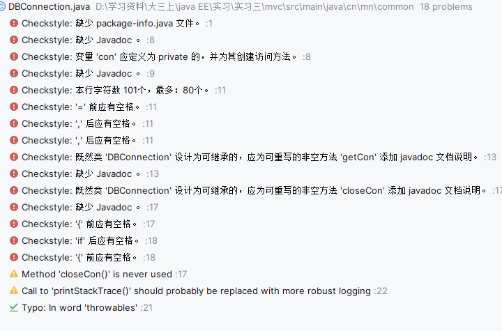
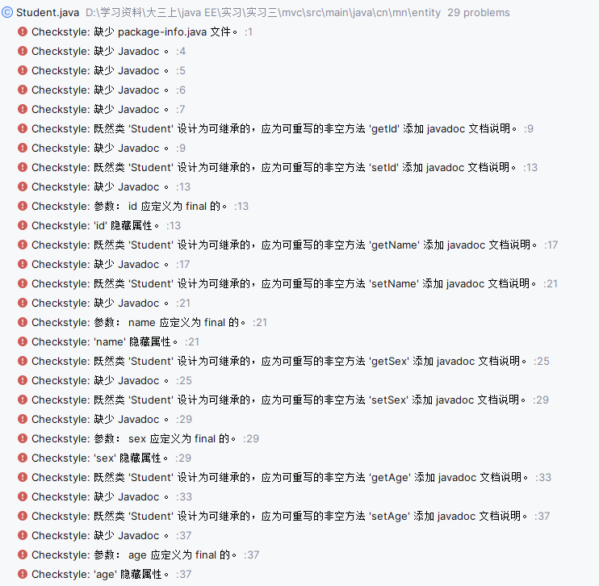
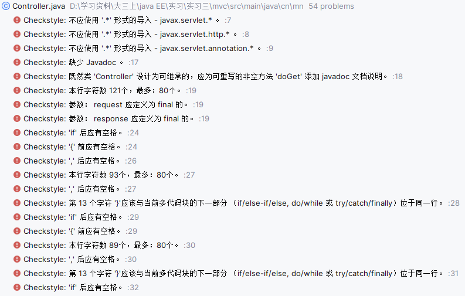

# 测试报告——静态代码分析

### 题目一：选择排序

- #### 静态检查前代码

  ~~~java
  import java.util.Arrays;
  public class ChoiceSort {
      int[] arr;
      public ChoiceSort(int[] nums) {
          arr = nums;
      }
      public void sort() {
          for (int i = 0; i < this.arr.length; i++)
              for (int j = i + 1; j < this.arr.length; j++) {
                  if (arr[i] < arr[j]) {
                      swap(i,j);
                  }
              }
      }
      public void print() {
          System.out.println(Arrays.toString(arr));
      }
      public void swap(int i,int j) {
          int temp = arr[i];
          arr[i] = arr[j];
          arr[j] = temp;
      }
  }
  ~~~

- #### 开启静态检查

  - 

  - ##### 主要错误

    - 缺少package-info.java文件
    - 方法和属性缺少javadoc
    - 不改变的变量声明为final
    - for循环必须后接花括号
    - 变量使用“,”隔开时要后接空格
    - 设置属性访问等级

- #### 代码修改后

  ~~~java
  import java.util.Arrays;
  public class ChoiceSort {
      /** arr变量.
       * 定义排序数组
      */
      private int[] arr;
      
      /** 构造方法.
       * @param nums 我待排序数组
       */
      public ChoiceSort(final int[] nums) {
          arr = nums;
      }
  
      /** 排序方法 使用选择排序，结果是从大到小的序列.
       */
      public void sort() {
          for (int i = 0; i < this.arr.length; i++) {
              for (int j = i + 1; j < this.arr.length; j++) {
                  if (arr[i] < arr[j]) {
                      swap(i, j);
                  }
              }
          }
      }
  
      /** 打印方法.
       * 输出排序后的数组
       */
      public void print() {
          System.out.println(Arrays.toString(arr));
      }
  
      /** 交换方法.
       * @param i 待交换数组元素的下标
       * @param j 待交换数组元素的下标
       */
      public void swap(final int i, final int j) {
          int temp = arr[i];
          arr[i] = arr[j];
          arr[j] = temp;
      }
  }
  ~~~

### 题目二：三角形问题

- #### 静态检查前代码

  ~~~java
  public class Triangle {
      int a;
      int b;
      int c;
      public Triangle(int a,int b,int c) {
          this.a = a;
          this.b = b;
          this.b = c;
      }
  
      public String judge() {
          if (a + b <= c || a + c <= b || b + c <= a) {
              return "无法构成三角形";
          }
          if (a == b && c == b) {
              return "等边三角形";
          }
  
          if (a == b || c == b || a == c) {
              return "等腰三角形";
          }
  
          return "不等三角形";
      }
  }
  ~~~

  

- #### 开启静态检查

  - 
  - 主要错误
    - 设置属性访问等级
    - 属性和方法缺少javadoc
    - 不改变的变量声明为final
    - 变量使用“,”隔开时要后接空格

- #### 代码修改后

  ~~~java
  public class Triangle {
      /** 三角形一边.
       */
      private int a;
      /** 三角形一边.
       */
      private int b;
      /** 三角形一边.
       */
      private int c;
  
      /** 类构造方法.
       * @param aa 三角形一边
       * @param bb 三角形一边
       * @param cc 三角形一边
       */
      public Triangle(final int aa, final int bb, final int cc) {
          this.a = aa;
          this.b = bb;
          this.c = cc;
      }
  
      /** 判断方法.
       * 先判断是否是三角形
       * 在判断是否是等边和等腰三角形
       * 否则为不等三角形
       * @return 返回结果字符串
       */
      public String judge() {
          if (a + b <= c || a + c <= b || b + c <= a) {
              return "无法构成三角形";
          }
          if (a == b && c == b) {
              return "等边三角形";
          }
          if (a == b || c == b || a == c) {
              return "等腰三角形";
          }
          return "不等三角形";
      }
  }
  ~~~

  

### 题目三：日期

- #### 静态检查前代码

  ~~~java
  public class Date {
      int year;
      int month;
      int day;
  
      public Date(int y,int m,int d) {
          year = y;
          month = m;
          day = d;
      }
  
      public String gapNext() {
          int y = year;
          int m = month;
          int d = day + 2;
          // 1、如果是二月，判断闰年
          if (this.month == 2) {
              if (isLeap()) {
                  if (d > 29) {
                      m = 3;
                      d %= 29;
                  }
              } else {
                  if (d > 28) {
                      m = 3;
                      d %= 28;
                  }
              }
          } else {
              int totalDay = isMonth()? 31 : 30;
              if (d > totalDay) {
                  m += 1;
                  d %= totalDay;
                  if (m > 12) {
                      m %= 12;
                      y++;
                  }
              }
          }
          return y+"-"+m+"-"+d;
      }
  
      public boolean isLeap() {
          return this.year % 400 == 0 || (this.year % 100 != 0 && this.year % 4 == 0);
      }
  
      //返回True 大月，False 小月
      public boolean isMonth() {
          return this.month != 4 && this.month != 6 && this.month != 9 && this.month != 11;
      }
  }
  ~~~

  

- #### 开启静态检查

  - 
  - 主要错误
    - 设置属性访问等级
    - 属性和方法缺少javadoc
    - 不改变的变量声明为final
    - 变量使用“,”隔开时要后接空格
    - 常量又有命名
    - impot不能使用“.*”
    - 一行最多80个字符

- #### 代码修改后

  - Date.java

  ~~~java
  package date;
  
  import static date.Const.FEBRARY_DAYS;
  import static date.Const.FEBRARY_LEAP_DAYS;
  import static date.Const.LARGE_DAYS;
  import static date.Const.LEAP_FOUR;
  import static date.Const.SMALL_DAYS;
  import static date.Const.LEAP_HUNDRED;
  import static date.Const.LEAP_FOUR_HUNDRED;
  import static date.Const.MONTHS;
  import static date.Const.APR;
  import static date.Const.JUN;
  import static date.Const.NOV;
  import static date.Const.SEP;
  
  public class Date {
      /** 表示日期中的年份.
      */
      private final int year;
  
      /** 表示日期中的月份.
       */
      private final int month;
  
      /** 表示日期中的日.
       */
      private final int day;
  
      /** 构造函数.
       * @param y 表示日期中的年份
       * @param m 表示日期中的年份
       * @param d 表示日期中的年份
       */
      public Date(final int y, final int m, final int d) {
          year = y;
          month = m;
          day = d;
      }
  
      /** 得到两天后的日期.
       * @return 结果为字符串
       */
      public String gapNext() {
          int y = year;
          int m = month;
          int d = day + 2;
          // 1、如果是二月，判断闰年
          if (this.month == 2) {
              if (isLeap()) {
                  if (d > FEBRARY_LEAP_DAYS) {
                      m++;
                      d %= FEBRARY_LEAP_DAYS;
                  }
              } else {
                  if (d > FEBRARY_DAYS) {
                      m++;
                      d %= FEBRARY_DAYS;
                  }
              }
          } else {
              int totalDay = isMonth() ? LARGE_DAYS : SMALL_DAYS;
              if (d > totalDay) {
                  m += 1;
                  d %= totalDay;
                  if (m > MONTHS) {
                      m %= MONTHS;
                      y++;
                  }
              }
          }
          return y + "-" + m + "-" + d;
      }
  
      /** 判断是否是闰年.
       * @return true为闰年
       */
      public boolean isLeap() {
          if (this.year % LEAP_FOUR_HUNDRED == 0) {
              return true;
          }
  
          if (this.year % LEAP_HUNDRED != 0 && this.year % LEAP_FOUR == 0) {
              return true;
          }
          return false;
      }
  
      /** 判断大小月.
       * @return 返回True 大月，False 小月
       */
      public boolean isMonth() {
          if (this.month == APR || this.month == JUN) {
              return false;
          }
          if (this.month != SEP && this.month != NOV) {
              return false;
          }
          return true;
      }
  }
  ~~~

  - 常量文件，Const,java

  ~~~java
  package date;
  
  public class Const {
      /** 防止识别为工具类.
       */
      private final int a;
      /** 表示闰年二月的天数.
       */
      public static final int FEBRARY_LEAP_DAYS = 29;
      /** 表示非闰年二月的天数.
       */
      static final int FEBRARY_DAYS = 28;
      /** 表示大月的天数.
       */
      public static final int LARGE_DAYS = 31;
      /** 表示小月的天数.
       */
      static final int SMALL_DAYS = 30;
      /** 表示一年总月数.
       */
      static final int MONTHS = 12;
      /** 被四百整除为闰年.
       */
      static final int LEAP_FOUR_HUNDRED = 400;
      /** 不能被一百整除且被四整除为闰年.
       */
      static final int LEAP_HUNDRED = 100;
      /** 不能被一百整除且被四整除为闰年.
       */
      static final int LEAP_FOUR = 4;
      /** 4月.
       */
      static final int APR = 4;
      /** 6月.
       */
      static final int JUN = 6;
      /** 9月.
       */
      static final int SEP = 9;
      /** 十一月.
       */
      static final int NOV = 11;
      /** 构造方法.
       */
      public Const() {
          this.a = 1;
      }
  }
  ~~~

  

### 题目四：工程测试

- #### 项目概览——学生信息管理

  - MVC架构

    

- #### 开启静态检查

  - DBConnection.java 错误
    - 
  - Student.java 错误
    - 
  - StudentService.java 错误
    - 
  - Controller.java 错误
    - 

- #### 代码修改

  - 添加**package-info.java**
  - 修改 “**.***” 导入方式
  - 分隔符、关键字，括号前后空格
  - 设置属性访问级别
  - 添加**javadoc**
  - 单行字符最大为80个
  - 没有修改的变量定义为**final**
  - 常量要有名称
  - 属性名称符合表达式 **‘^\[a-z\]\[a-zA-Z0-9\]*$' **
  - **else**与上一个花括号在同一行