# 单元测试

## 实验题1

- #### 测试代码

  - ```java
    import org.junit.jupiter.api.Assertions;
    import org.junit.Test;
    
    public class Practice_1Test {
        Practice_1 practice1 = new Practice_1();
    
        @Test
        public void common_divisor() {
            int a = 144;
            int b = 24;
            Assertions.assertEquals(24, practice1.common_divisor(a,b));
        }
    
        @Test
        public void common_multiple() {
            int a = 144;
            int b = 24;
            Assertions.assertEquals(144, practice1.common_multiple(a,b));
        }
    
        @Test
        public void seek_1() {
            int a[] = {1,4,5,3,6,23,67,23,745};
            Assertions.assertEquals(true, practice1.seek_1(a,4));
        }
    }
    ```

## 实验题2

- #### 判断素数程序

  ```java
  import static java.lang.Math.sqrt;
  
  public class Practice_2 {
      public boolean isPrime(int num) {
          for (int i=2;i<sqrt(num);i++){
              if (num % i == 0) {
                  return false;
              }
          }
          return true;
      }
  }
  ```

- #### 测试程序，使用setUp()初始化测试环境

  ```java
  import org.junit.jupiter.api.Assertions;
  import org.junit.Before;
  import org.junit.Test;
  
  public class Practice_2Test {
      private int num;
      private Practice_2 obj;
  
      @Before
      public void setUp() {
          num = 34;
          obj = new Practice_2();
      }
  
      @Test
      public void isPrime() {
          Assertions.assertFalse(obj.isPrime(num));
      }
  }
  ```

## 实验题3

#### 1、请用TestCase方法对程序中的isHoliday（）方法进行Junit测试

- 测试代码

  ```java
  import org.junit.jupiter.api.Assertions;
  import org.junit.Test;
  
  public class HolidaySkedTest {
      @Test
      public void isHoliday() {
          HolidaySked holidaySked = new HolidaySked();
          Assertions.assertTrue(holidaySked.isHoliday(165));
      }
  }
  ```

- 测试结果

  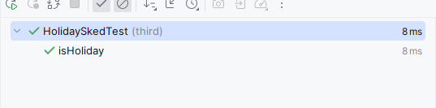

#### 	2、用参数化的方法重新设计本题和实验题1的测试用例

- ##### 本题

  - 测试代码

    ```java
    import org.junit.Test;
    import org.junit.jupiter.api.Assertions;
    import org.junit.runner.RunWith;
    import org.junit.runners.Parameterized;
    
    import java.util.Arrays;
    import java.util.Collection;
    
    @RunWith(Parameterized.class)
    public class HolidaySkedArgsTest {
        private int hoildays;
        private boolean res;
        private HolidaySked h = new HolidaySked();
    
        @Parameterized.Parameters
        public static Collection<Object[]> data(){
            Object[][] object={{30,false},{29,false},{43,true}};
            return Arrays.asList(object);
        }
    
        public HolidaySkedArgsTest(int hoildays,boolean res) {
            this.hoildays = hoildays;
            this.res = res;
        }
    
        @Test
        public void isHoliday() {
            Assertions.assertEquals(res,h.isHoliday(hoildays));
        }
    }
    ```

  - 测试结果

    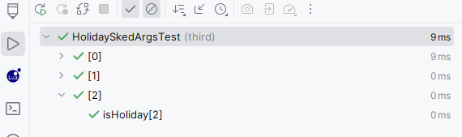

- ##### 实验题1common_divisor和common_multiple

  - 测试代码

    ```java
    import org.junit.jupiter.api.Assertions;
    import org.junit.Test;
    import org.junit.runner.RunWith;
    import org.junit.runners.Parameterized;
    import java.util.Arrays;
    import java.util.Collection;
    
    @RunWith(Parameterized.class)
    public class Practice_1ArgsTest {
        private Practice_1 p = new Practice_1();
        private int a; private int b; private int div_res; private int mul_res;
    
        @Parameterized.Parameters
        public static Collection<Object[]> data(){
            Object[][] object={{30,4,2,60},{29,2,1,58},{28,2,2,28}};
            return Arrays.asList(object);
        }
    
        public Practice_1ArgsTest(int a, int b,int divRes,int mul_res) {
            this.a = a;
            this.b = b;
            this.div_res = divRes;
            this.mul_res = mul_res;
        }
    
        @Test
        public void common_divisor() {
            Assertions.assertEquals(div_res,p.common_divisor(a,b));
        }
    
        @Test
        public void common_multiple() {
            Assertions.assertEquals(mul_res,p.common_multiple(a,b));
        }
    }
    ```

    

  - 测试结果

    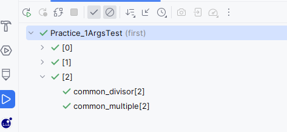

- ##### 实验题1seek_1

  - 测试代码

    ```java
    import org.junit.Assert;
    import org.junit.Test;
    import org.junit.runner.RunWith;
    import org.junit.runners.Parameterized;
    import org.junit.runners.Parameterized.Parameters;
    import java.util.Arrays;
    import java.util.Collection;
    
    @RunWith(Parameterized.class)
    public class Practice_1SeekTest {
        private Practice_1 p = new Practice_1();
        private int[] nums;
        private int target;
        private boolean res;
    
        @Parameters
        public static Collection<Object[]> data(){
            Object[][] object={{new int[]{1,4,5,8,3},5,true},{new int[]{29,2,1,58},4,false}};
            return Arrays.asList(object);
        }
    
        public Practice_1SeekTest(int[] nums,int target,boolean res) {
            this.nums = nums;
            this.res = res;
            this.target = target;
        }
    
        @Test
        public void seek_1() {
            Assert.assertEquals(res, p.seek_1(nums, target));
        }
    }
    ```

  - 测试结果

    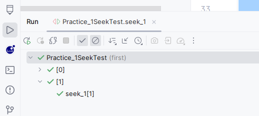

####     3、再用Suite方法对实验1-3的所有单个测试类组装进行套件测试

- 测试代码

  ```java
  import first.Practice_1Test;
  import org.junit.runner.RunWith;
  import org.junit.runners.Suite;
  import second.Practice_2Test;
  
  @RunWith(Suite.class)
  @Suite.SuiteClasses({Practice_1Test.class, Practice_2Test.class, HolidaySkedTest.class})
  public class testAll {
  }
  ```

- 测试结果

  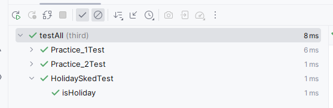

## 实验题4

#### 	1、自动化测试

- 测试用例

  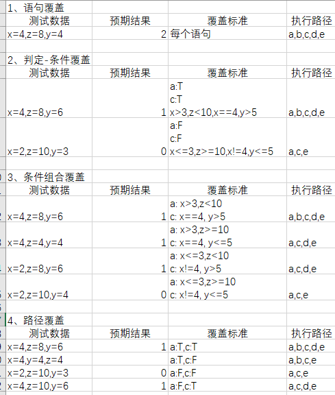

  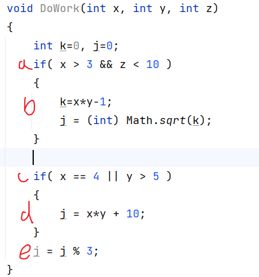

- 测试代码

  ```java
  import org.junit.Test;
  import org.junit.jupiter.api.Assertions;
  import org.junit.runner.RunWith;
  import org.junit.runners.Parameterized;
  import java.util.Arrays;
  import java.util.Collection;
  import static org.junit.Assert.*;
  
  @RunWith(Parameterized.class)
  public class P4Test {
      private P4 p = new P4();
      private int x;
      private int y;
      private int z;
      private int res;
  
      @Parameterized.Parameters
      public static Collection<Object[]> data(){
          Object[][] object={{4,4,8,2},{4,6,8,1},{2,3,10,0},{4,6,8,1},{2,6,8,1},{2,4,10,0},{4,6,10,1},{4,4,4,2}};
          return Arrays.asList(object);
      }
  
      public P4Test(int x,int y,int z,int res) {
          this.x = x;
          this.y = y;
          this.z = z;
          this.res = res;
      }
  
      @Test
      public void doWork() {
          Assertions.assertEquals(res,p.DoWork(x,y,z));
      }
  }
  ```

- 测试结果

  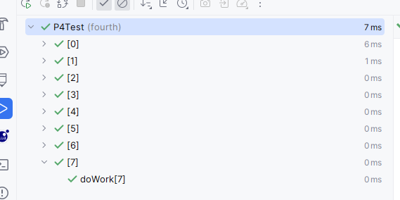

#### 	2、覆盖率分析

- 覆盖结果

  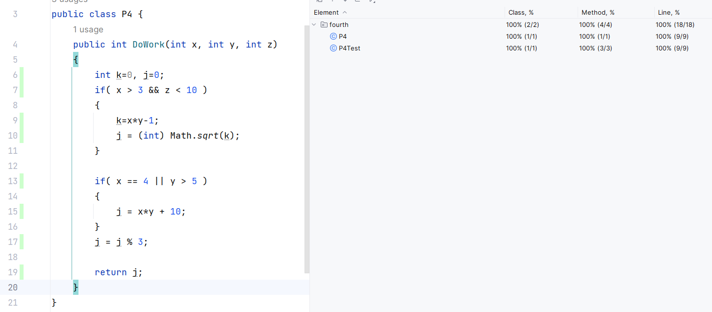

## 实验题5

#### 1、选择排序

- 测试代码

  ```java
  import org.junit.Assert;
  import org.junit.Test;
  import org.junit.runner.RunWith;
  import org.junit.runners.Parameterized;
  import java.util.Arrays;
  import java.util.Collection;
  
  @RunWith(Parameterized.class)
  public class ChoiceSortTest {
      private ChoiceSort cs = new ChoiceSort();
      private int[] nums;
      private int[] res;
  
      @Parameterized.Parameters
      public static Collection<Object[]> data(){
          Object[][] object={{new int[]{1,4,72,2},new int[]{72,4,2,1}}};
          return Arrays.asList(object);
      }
  
      public ChoiceSortTest(int[] nums,int[] res) {
          this.nums = nums;
          this.res = res;
      }
  
      @Test
      public void sort() {
          Assert.assertArrayEquals(res,cs.sort(nums));
      }
  }
  ```

  

- 覆盖率分析

  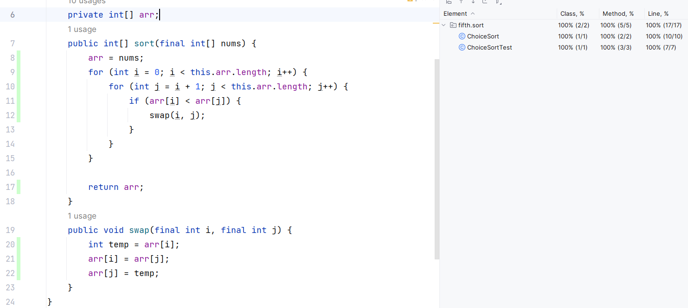

#### 2、三角形问题

- 测试代码

  ```java
  import org.junit.Assert;
  import org.junit.Test;
  import org.junit.runner.RunWith;
  import org.junit.runners.Parameterized;
  
  import java.util.Arrays;
  import java.util.Collection;
  
  @RunWith(Parameterized.class)
  public class TriangleTest {
      private int a;
      private int b;
      private int c;
      private String res;
      private Triangle t = new Triangle();
  
      @Parameterized.Parameters
      public static Collection<Object[]> data(){
          Object[][] object={{4,4,8,"无法构成三角形"},{4,4,4,"等边三角形"},{10,3,10,"等腰三角形"},{4,6,8,"不等三角形"}};
          return Arrays.asList(object);
      }
  
      public TriangleTest(int x,int y,int z,String res) {
          this.a = x;
          this.b = y;
          this.c = z;
          this.res = res;
      }
  
      @Test
      public void judge() {
          Assert.assertEquals(res,t.judge(a,b,c));
      }
  }
  ```

- 覆盖率分析

  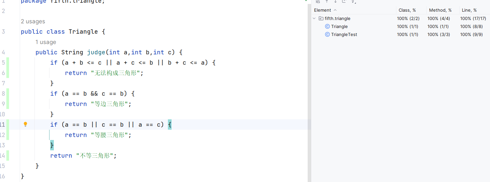

#### 3、隔一日问题

- 测试代码

  ```java
  import org.junit.Assert;
  import org.junit.Test;
  import org.junit.runner.RunWith;
  import org.junit.runners.Parameterized;
  import java.util.Arrays;
  import java.util.Collection;
  
  @RunWith(Parameterized.class)
  public class DateTest {
      private Date d = new fifth.data.Date();
      private int year;
  
      /** 表示日期中的月份.
       */
      private int month;
  
      /** 表示日期中的日.
       */
      private int day;
      private String res ;
      @Parameterized.Parameters
      public static Collection<Object[]> data(){
          Object[][] object={{2000,2,20,"2000-2-22"},
                              {2000,2,28,"2000-3-1"},
                              {2001,12,30,"2002-1-1"},
                              {2001,12,28,"2001-12-30"},
                              {2001,2,26,"2001-2-28"},
                              {2001,2,27,"2001-3-1"},
                              {2001,11,30,"2001-12-2"}};
          return Arrays.asList(object);
      }
  
      public DateTest(int y,int m,int d,String res) {
          year = y;
          month = m;
          day = d;
          this.res = res;
      }
  
      @Test
      public void gapNext() {
          Assert.assertEquals(res,d.gapNext(year,month,day));
      }
  }
  ```

- 覆盖率分析

  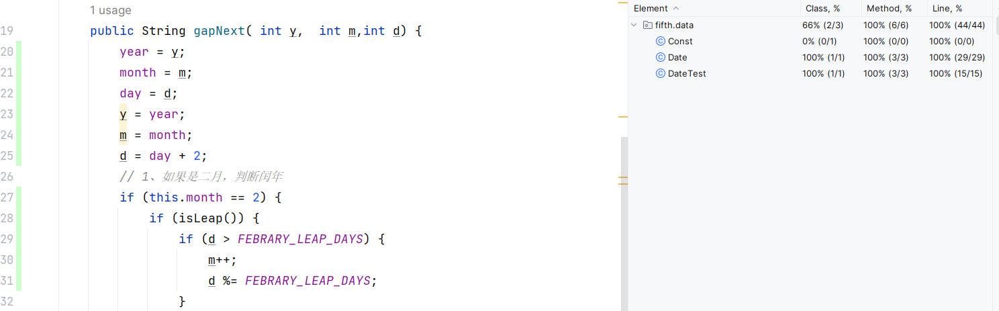

## 实验题6

- 构建结果

  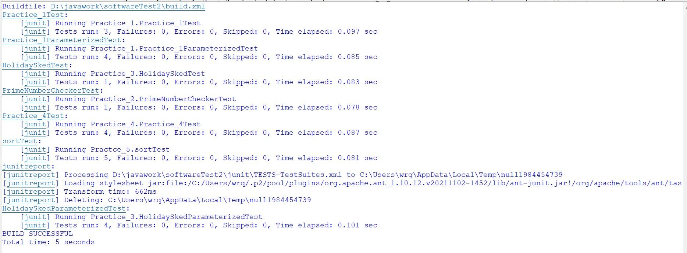