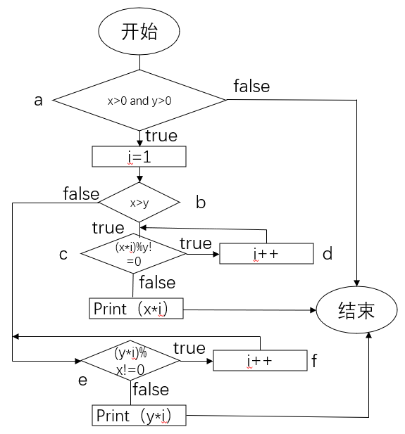
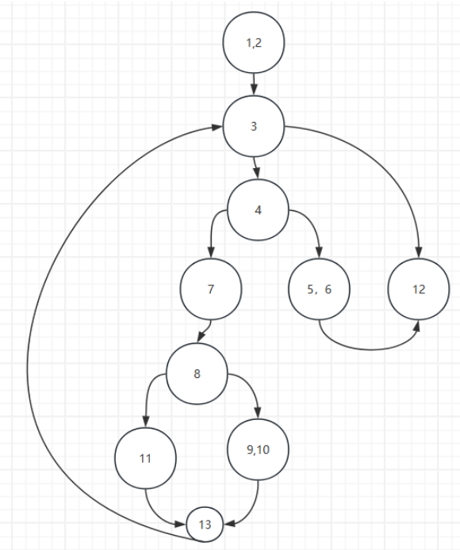

# 第一题

### 1）

- ##### 自己画个流程图，标上号，给判定条件标号

- ##### 然后改改测试数据

# 第二题

### 1）请用MC/DC方法设计A&&B||C的测试用例

### 2）请用BRO方法设计B1||（E3==E4）的错误敏感约束集合

- ##### 没啥改的

# 第三题

### 1）请用基本路径测试方法设计下列程序的测试用例

- ##### 画个流图

- ##### 把路径都走一遍，改改测试数据

### 2）没教呢